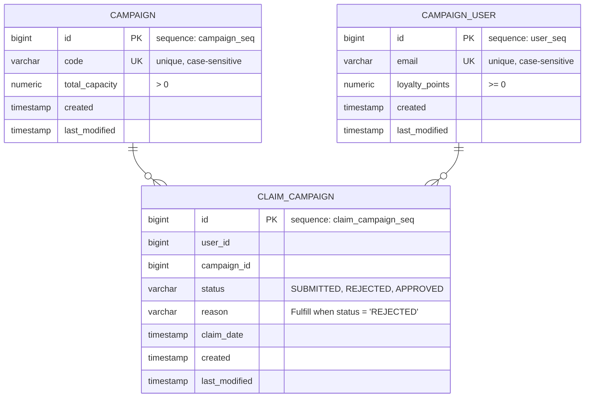
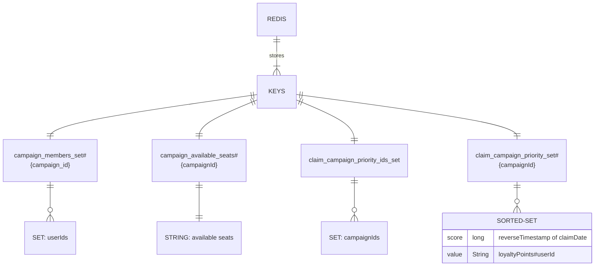

## Postgres Entity Relationship Diagram

```mermaid
erDiagram
    CAMPAIGN ||--o{ CLAIM_CAMPAIGN : ""
    CAMPAIGN_USER ||--o{ CLAIM_CAMPAIGN : ""

    CAMPAIGN {
        bigint    id PK "sequence: campaign_seq"
        varchar   code UK "unique, case-sensitive"
        numeric   total_capacity "> 0"
        timestamp created
        timestamp last_modified
    }

    CAMPAIGN_USER {
      bigint    id PK "sequence: user_seq"
      varchar   email UK "unique, case-sensitive"
      numeric   loyalty_points ">= 0"
      timestamp created
      timestamp last_modified
    }

    CLAIM_CAMPAIGN {
      bigint     id PK "sequence: claim_campaign_seq"
      bigint     user_id
      bigint     campaign_id
      varchar    status "SUBMITTED, REJECTED, APPROVED"
      varchar    reason "Fulfill when status = 'REJECTED'"
      timestamp  claim_date
      timestamp  created
      timestamp  last_modified
    }

```

## Redis Entity Diagram

```mermaid

erDiagram
    REDIS ||--|{ KEYS : stores

    KEYS ||--|| "campaign_members_set#{campaign_id}" : ""
    "campaign_members_set#{campaign_id}" ||--o{ "SET: userIds" : ""
    
    KEYS ||--|| "campaign_available_seats#{campaignId}" : ""
    "campaign_available_seats#{campaignId}" ||--|| "STRING: available seats" : ""
    
    KEYS ||--|| "claim_campaign_priority_ids_set" : ""
    "claim_campaign_priority_ids_set" ||--o{ "SET: campaignIds" : ""


    KEYS ||--|| "claim_campaign_priority_set#{campaignId}" : ""
    "claim_campaign_priority_set#{campaignId}" ||--o{ "SORTED-SET" : ""

    SORTED-SET {
        score  long    "reverseTimestamp of claimDate"
        value  String  "loyaltyPoints#userId"
    }
    
```

