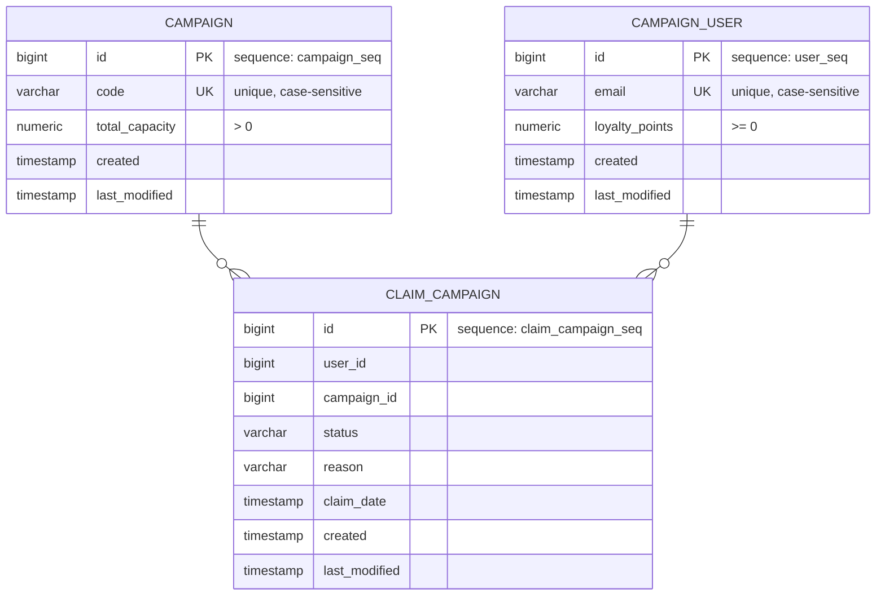

## ERD

```mermaid
erDiagram
    CAMPAIGN ||--o{ CLAIM_CAMPAIGN : ""
    CAMPAIGN_USER ||--o{ CLAIM_CAMPAIGN : ""

    CAMPAIGN {
        bigint    id PK "sequence: campaign_seq"
        varchar   code UK "unique, case-sensitive"
        numeric   total_capacity "> 0"
        timestamp created
        timestamp last_modified
    }

    CAMPAIGN_USER {
      bigint    id PK "sequence: user_seq"
      varchar   email UK "unique, case-sensitive"
      numeric   loyalty_points ">= 0"
      timestamp created
      timestamp last_modified
    }

    CLAIM_CAMPAIGN {
      bigint     id PK "sequence: claim_campaign_seq"
      bigint     user_id
      bigint     campaign_id
      varchar    status
      varchar    reason
      timestamp  claim_date
      timestamp  created
      timestamp  last_modified
    }

```
